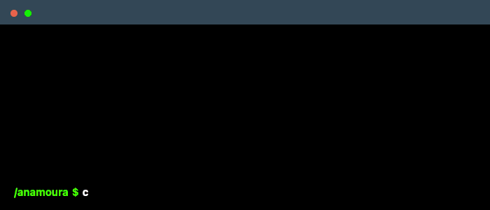

 

  

---

## About me

- 🐍 I **teach Python to kids** — turning "I don't get it" into "look what I made!"
- 🥋 I help build **DOJO**, a learning platform for coding schools
- 🎓 Recently graduated in IT, and still learning every day
- 🌏 Brazilian, living in Auckland
- ⚡ Still learning, still building, still surprised when it works first try!

## Main skills

  

## Studying

  

## Projects

| Project | What it is |
|---|---|
| [rnd-portfolio-management-system](https://github.com/anamoura-dev/rnd-portfolio-management-system) | R&D portfolio management system — university team project |
| [pocket-stylist](https://github.com/anamoura-dev/pocket-stylist) | Wardrobe and outfit app |
| [cabsonline](https://github.com/anamoura-dev/cabsonline) | Full-stack ride booking system |
| [secret-number-game](https://github.com/anamoura-dev/secret-number-game) | Guess the number, with voice recognition |
| [about-me](https://github.com/anamoura-dev/about-me) | My first personal page |

## GitHub stats

  
  

## Let's talk

  

